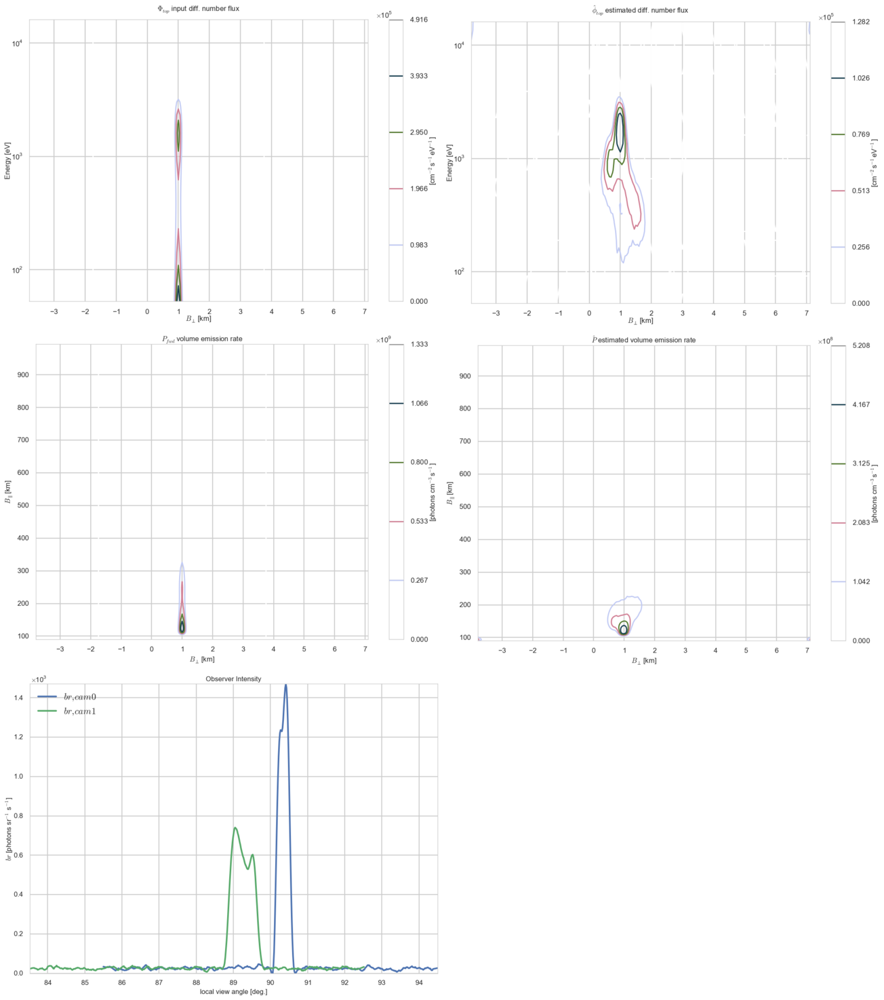

[](https://codeclimate.com/github/scienceopen/hist-feasibility)
[](https://travis-ci.org/scienceopen/hist-feasibility)
[](https://coveralls.io/r/scienceopen/hist-feasibility?branch=master)

hist-feasibility
================
Feasibility study for auroral tomography

This program should be runnable on any Python 3.4 or 2.7 platform. 

Primarily tested on Linux, but should work on Mac or Cygwin (windows) as well.



installation:
------------
go to the directory where you want to install this program under e.g. ~/code

then, in Terminal (for Linux, Mac or Cygwin on Windows), copy and paste:

    git clone --recursive --depth 1 https://github.com/scienceopen/hist-feasibility

    cd hist-feasibility

    ./setup.sh

You can check that things are working OK by:

    python registration.py

which should give several lines of text ending with:

    registration.py done looping

    registration.py program end


Usage notes:
------------
if upon changing the in/*.xlsx files to make a new simulation, you get an error message
including
``` use --ell command line option to save new Ell file ```
rerun your simulation command, adding --ell to compute (one-time) the projection
matrix for your new simulation geometry.

examples:
---------

simulate flaming aurora with two cameras:

    python -u main_hist.py in/2cam_flame.xlsx out/rev1_flame2/ -m fwd optim png

below this line examples may be out of date (may not work at the moment)

------------

draft 2015 SIMULATION commands were like:
    
    python3 main_hist.py in/jgr2013_2cam_flame.xlsx /tmp --minev 150 -m fwd optim gfit eig eig1d ell eavg png --vlim -3.8 7.1 90 350 1e5 1e8 --jlim 0 7e4 --blim 0 2.5e9 -f 2 5 1 --ell
    
reading real data:

    python3 main_hist.py in/jgr2013_realdata.xlsx /tmp -m realvid fwd optim png rawpng --vlim -3.8 7.1 90 350 0 30 --jlim nan 0.15 --blim 0 2500 -f 0 1 1

dump raw frames with time superimposed to disk without axes (for draft, -f 30 70 10)
    
    python3 main_hist.py in/jgr2013_realdata.xlsx /tmp -m singleraw rawpng -f 30 70 10

plot eigenprofiles from 2013 JGR and current transcar sim
    
    python3 main_hist.py in/jgr2013_2cam.xlsx /tmp -m eig eig1d -p  -f 0 1 1

    python3 main_hist.py in/2cam_flame.xlsx /tmp -m eig eig1d -p --vlim 0 0 90 1000 1e-1 5e3 -f 0 1 1

plot selection
---------------
```-m rawpng``` saves the real video frames you chose to PNG with annotations/axes

```-m realvid``` both cameras in one big figure

```-m singleraw``` each camera images individually, without axes (for powerpoint,posters, etc.)

```-m eps``` ```-m png``` save figures as eps or png respectively

```-m eig ``` plot eigenprofiles

```-m spectra``` plot modeled auroral spectra modulated by the filter used.

plot limits
------------
``` --vlim xmin xmax zmin zmax pmin pmax ```  limits for VER plots and eigenprofile plots (including 1-D)

``` --jlim min max ``` flux limits for diff num flux plots

``` --blim min max ``` flux limits for brightness plots

Plot explanation
-----------------
The plots you see under your out/ direction (assuming you used -m png or -m eps or the like)
follow this naming convention

``` phifwd ``` this is your "known" input differntial number flux of the electron precipitation 
to the simulation (for real data, we don't have this)

``` phiest ``` this is the unobservable "unknown" we estimate with this program (for real and simulated data)

``` pfwd ``` and ``` pest ``` volume emission rate due to simulated / estimated flux respectively

``` bfwd ``` and ``` best ``` camera optical intensity due to simulated / estimated flux respectively

Our IEEE TGARS article (in review) details the math and algorithm.

calibration
-------------
The first program, rawDMCreader.py, accesses the raw camera data and averages the selected frames and writes the average as a FITS file

The second line moves this FITS file to the user-selected calibration directory

The third line uses my wrapper and post-processing based on Astrometry.net to make an HDF5 file of the mapping from each pixel to sky coordinates (ra/dec and az/el). 

cam0
```
 ./histutils/rawDMCreader.py -i ~/HSTdata/DataField/2013-04-14/HST0/2013-04-14T07-00-CamSer7196_frames_363000-1-369200.DMCdata -f 0 10 1 --avg --fits
 mv ~/HSTdata/DataField/2013-04-14/HST1/2013-04-14T07-00-CamSer7196_frames_363000-1-369200_mean_frames.fits ~/HST/calibration/hst0cal.fits
 ./astrometry/fits2azel.py -i ~/HST/calibration/hst0cal.fits --h5 -c 65.1186367 -147.432975 -t 2013-04-14T08:54:00Z --png
```

cam1
```
 ./histutils/rawDMCreader.py -i ~/HSTdata/DataField/2013-04-14/HST1/2013-04-14T07-00-CamSer1387_frames_205111-1-208621.DMCdata -f 0 10 1 --avg --fits
 mv ~/HSTdata/DataField/2013-04-14/HST1/2013-04-14T07-00-CamSer1387_frames_205111-1-208621_mean_frames.fits ~/HST/calibration/hst1cal.fits
 ./astrometry/fits2azel.py -i ~/HST/calibration/hst1cal.fits --h5 -c 65.12657 -147.496908333 -t 2013-04-14T08:54:00Z --png
```

